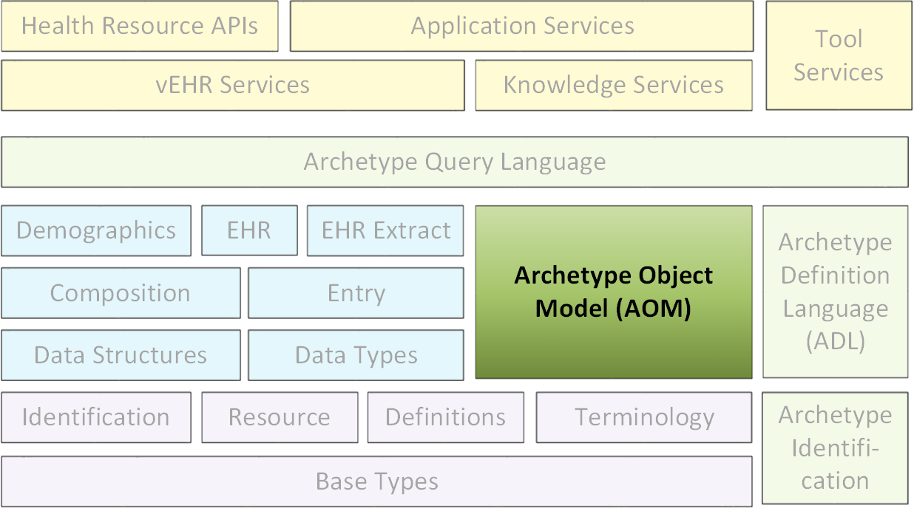

//
// ============================================ Asciidoc HEADER =============================================
//
:doctype: book
:source-highlighter: pygments
:pygments-style: murphy
//:toc: macro
:toc: left
:toclevels: 4
:pagenums:
:numbered!:
// git rid of PDF 'Chapter' labs on level 1 headings
:chapter-label:
:copyright_year: 2004
//
// HTML-only attributes
//
:linkcss:
:keywords: EHR, ADL, AOM, health records, archetypes, constraint language, 13606, CIMI
:description: openEHR Archetype Object Model (AOM2) specification

//
// ============================================ Asciidoc PREAMBLE =============================================
//

image::{resources_dir}/images/openehr_logo_large.png["openEHR logo",align="center"]

= Archetype Object Model (AOM2)

[cols="1,1,1"]
|===
3+^|*Issuer*: http://www.openehr.org/programs/specification/[openEHR Specification Program]

|*Revision*: <<latest_issue>>
|*Date*: <<latest_issue_date>>
|*Status*: TRIAL

3+^|*Keywords*: {keywords}
|===

 

include::{resources_dir}/boilerplate/licence_block.adoc[]

//
// ============================================= Asciidoc BODY ===============================================
//

== Amendment Record

[cols="1,6,2,2", options="header"]
|===
|Issue|Details|Raiser|Completed

|[[latest_issue]]2.1.14
|Refactor `ARCHETYPE` and `ARCHETYPE_TERMINOLOGY` models, in order to simplify: remove differential and flat forms of classes. +
 Split `ARCHETYPE` into two classes, with `AUTHORED_ARCHETYPE` as a new class that inherits from `AUTHORED_RESOURCE` .
|T Beale
|[[latest_issue_date]]04 Jan 2015

|2.1.13
|Remove `VDSSR` , `VSUNC` ; add `VDSSID` , `VARXID` . Replace ‘+u’ (unstable) version modifier with semver.org standard ‘-alpha’. Remove overview material to new Archetypes: Technical Overview specification.
|T Beale, +
 I McNicoll, +
 S Garde
|12 Nov 2014

|2.1.12
|Remove `ARCHETYPE` .uid attribute.
|H Solbrig
|08 Oct 2014

|2.1.11
|Correct spelling of ‘licence’ to international English; rename `ARCHETYPE`.`_urn_` to `_provenance_id_`.
|S Garde, +
 I McNicoll
|29 Sep 2014

|2.1.10
|Modified `C_ARCHETYPE_ROOT` to have an id-code in all cases.
 Add error `VSONPO` , `VSONPT` : specialised archetype object node prohibited occurrences validity. +
 Added support for constraints on enumerated types.
|CIMI, +
 P Langford, +
 T Beale
|18 Jul 2014

|2.1.9
|Convert `ARCHETYPE` .uid to urn: `URN` .
|I McNicoll, +
 S Garde, +
 T Beale
|04 Jun 2014

|2.1.8
|Rename `ARCHETYPE` .commit_number to `_build_count_` .
|I McNicoll, +
 S Garde, +
 T Beale
|21 May 2014

|2.1.7
|Make `VACMCL` a warning `WACMCL` .
|D Moner
|07 Apr 2014

|2.1.6
|Renamed `ARCHETYPE_INTERNAL_REF` to `C_OBJECT_PROXY` .
|T Beale
|09 Mar 2014

|2.1.5
|Renamed ontology to terminology and simplified.
|T Beale
|09 Jan 2014

|2.1.4
|Remove `CONSTRAINT_REF` , `C_REFERENCE_OBJECT` types; introduce new identification system.
|T Beale +
 H Solbrig
|07 Jan 2014

|2.1.3
|Detailed Technical Review.
|H Solbrig
|21 Nov 2013

|2.1.2
|Remove `C_DOMAIN_TYPE` ; +
 merge `C_PRIMITIVE_OBJECT` and `C_PRIMITIVE` ; +
 Add support for tuple constraints, replacing ADL 1.4 special Ordinal and Quantity constrainer types;
 Add new primitive type `C_TERMINOLOGY_CODE` .
 Added `VSONIF` , removed `VSONCI` (dup of `VSONI` ).
|H Solbrig +
 T Beale
|20 Aug2013

|2.1.1
|Remove `C_SINGLE_ATTRIBUTE` and `C_MULTIPLE_ATTRIBUTE` classes.
|T Beale, +
 S Garde, +
 S Kobayashi, +
 D Moner, +
 T Beale
|15 Dec 2011

|2.1.0
|SPEC-270. Add specialisation semantics to ADL and AOM. Add various attributes and functions to `ARCHETYPE_CONSTRAINT` descendant classes.

* move `C_PRIMITIVE`.`_assumed_value_` to attribute slot in UML
* rename `C_DEFINED_OBJECT`.`_default_value_` function to prototype_value
* correct `_assumed_value_` definition to be like ; remove its entry from all of the `C_PRIMITIVE` subtypes
* convert `BOOLEAN` flag representation of patterns to functions and add a String data member for the pattern value, thus matching the XSDs and ADL
* add `ARCHETYPE`.`_is_template_` attribute.
* add `ARCHETYPE`.`_is_component_` attribute.
* allow computed as well as stored attributes.
* make `ONTOLOGY`.`_terminologies_available_` computed.

|T Beale
|10 Dec 2009

|2.0.9
|SPEC-263. Change Date, Time etc classes in AOM to `ISO8601_DATE` , `ISO8601_TIME` etc from Support IM.
|T Beale
|20 Jul 2009

|
|SPEC-296. Convert _Interval<Integer>_ to `MULTIPLICITY_INTERVAL` to simplify specification and implementation.
|T Beale
|

|
|SPEC-300. Archetype slot regular expressions should cover whole identifier. Added `C_STRING`.`_is_pattern_` .
|A Flinton
|

|
|SPEC-303. Make existence, occurrences and cardinality optional in AOM.
|S Heard
|

|
|SPEC-308. Add validity rules to `ARCHETYPE_TERMINOLOGY` . +
SPEC-309. `ARCHETYPE_CONSTRAINT` adjustments. +
SPEC-178. Add template object model to AM. +

* Add `_is_exhaustive_` attribute to `ARCHETYPE_SLOT` .
* Add `_is_template_` attribute to `ARCHETYPE` .
* Add `_terminology_extracts_` to `ARCHETYPE_TERMINOLOGY` .

|T Beale
|

4+^|*R E L E A S E{nbsp}{nbsp}{nbsp}{nbsp}{nbsp}1.0.2*
{set:cellbgcolor:aqua}

|2.0.2
{set:cellbgcolor!}
|SPEC-257. Correct minor typos and clarify text. Correct reversed definitions of `_is_bag_` and `_is_set_` in `CARDINALITY` class.
|C Ma, +
 R Chen, +
 T Cook
|20 Nov 2008

|
|SPEC-251. Allow both pattern and interval constraint on Duration in Archetypes. Add pattern attribute to `C_DURATION` class.
|S Heard
|

4+^|*R E L E A S E{nbsp}{nbsp}{nbsp}{nbsp}{nbsp}1.0.1*
{set:cellbgcolor:aqua}

|2.0.1
{set:cellbgcolor!}
|CR-000200. Correct Release 1.0 typographical errors. Table for missed class `ASSERTION_VARIABLE` added. Assumed_value assertions corrected; `_standard_representation_` function corrected. Added missed `_adl_version_` , `_concept_` rename from CR-000153.
|D Lloyd, +
 P Pazos, +
 R Chen, +
 C Ma
|20 Mar 2007

|
|CR-000216: Allow mixture of W, D etc in ISO8601 Duration (deviation from standard).
|S Heard
|

|
|CR-000219: Use constants instead of literals to refer to terminology in RM.
|R Chen
|

|
|CR-000232. Relax validity invariant on `CONSTRAINT_REF` .
|R Chen
|

|
|CR-000233: Define semantics for `_occurrences_` on `ARCHETYPE_INTERNAL_REF` .
|K Atalag
|

|
|CR-000234: Correct functional semantics of AOM constraint model package.
|T Beale
|

|
|CR-000245: Allow term bindings to paths in archetypes.
|S Heard
|

4+^|*R E L E A S E{nbsp}{nbsp}{nbsp}{nbsp}{nbsp}1.0*
{set:cellbgcolor:aqua}

|2.0
{set:cellbgcolor!}
|CR-000153. Synchronise ADL and AOM attribute naming.
 CR-000178. Add Template Object Model to AM. Text changes only.
 CR-000167. Add `AUTHORED_RESOURCE` class. Remove `_description_` package to `_resource_` package in Common IM.
|T Beale
|10 Nov 2005

4+^|*R E L E A S E{nbsp}{nbsp}{nbsp}{nbsp}{nbsp}0.96*
{set:cellbgcolor:aqua}

|0.6
{set:cellbgcolor!}
|CR-000134. Correct numerous documentation errors in AOM. Including cut and paste error in `TRANSLATION_DETAILS` class in _Archetype_ package. Corrected hyperlinks in Section 2.3.
|D Lloyd
|20 Jun 2005

|
|CR-000142. Update ADL grammar to support assumed values. Changed `C_PRIMITIVE` and `C_DOMAIN_TYPE` .
|S Heard, +
 T Beale
|

|
|CR-000146: Alterations to _am.archetype.description_ from CEN MetaKnow
|D Kalra
|

|
|CR-000138. Archetype-level assertions.
|T Beale
|

|
|CR-000157. Fix names of `OPERATOR_KIND` class attributes
|T Beale
|

4+^|*R E L E A S E{nbsp}{nbsp}{nbsp}{nbsp}{nbsp}0.95*
{set:cellbgcolor:aqua}

|0.5.1
{set:cellbgcolor!}
|Corrected documentation error - return type of `ARCHETYPE_CONSTRAINT` . `_has_path_` + 
add optionality markers to Primitive types UML diagram. +
Removed erroneous aggregation marker from `ARCHETYPE_ONTOLOGY` . `_parent_archetype_` and `ARCHETYPE_DESCRIPTION` . `_parent_archetype_` .
|D Lloyd
|20 Jan 2005

|0.5
|CR-000110. Update ADL document and create AOM document. +
Includes detailed input and review from:

* DSTC
* CHIME, Uuniversity College London
* Ocean Informatics

Initial Writing. Taken from ADL document https://github.com/openEHR/specifications/blob/master/source/am/language/language_design/archetype_language_2v0.7.doc[1.2draft B].
|T Beale +
 A Goodchild +
 Z Tun +
 T Austin +
 D Kalra +
 N Lea +
 D Lloyd +
 S Heard +
 T Beale
|10 Nov 2004
|===

//
// --------------------------------------------- Preface -----------------------------------------------
//
== Acknowledgements
=== Primary Author
* Thomas Beale, Ocean Informatics UK; openEHR Foundation Management Board

=== Contributors
This specification and its sibling Archetype Definition Language specification have benefited from wide formal and informal input from the openEHR and wider health informatics community. The openEHR Foundation would like to recognise the following people and institutions.

* Koray Atalag, MD, PhD, Sen. Researcher, National Institute for Health Innovation (NIHI), New Zealand
* Linda Bird PhD, IHTSDO
* Diego Boscá, IBIME, Technical University Valencia, VeraTech for Health, Spain
* Rong Chen MD, PhD, Cambio Healthcare Systems, Sweden
* Borut Fabjan, Program Manager, Marand, Slovenia
* Sebastian Garde PhD, Ocean Informatics UK
* Peter Gummer, Ocean Informatics
* Sam Heard MD, Ocean Informatics
* Stan Huff MD, Intermountain Healthcare, UT, USA
* David Ingram PhD, Emeritus Professor of Health Informatics, UCL
* Dipak Kalra MD, PhD, Professor Health Informatics, CHIME, UCL, president Eurorec
* Shinji Kobayashi PhD, Kyoto University EHR research unit
* Bostjan Lah, Architect, Marand, Slovenia
* David Lloyd, CHIME, UCL (ret)
* Ian McNicoll MD, Ocean Informatics UK
* David Moner, IBIME, Technical University Valencia, VeraTech for Health, Spain
* Pablo Pazos Gutierrez, Tarmac IT, CaboLabs, Uruguay
* Harold Solbrig, Mayo Clinic, Rochester, USA
* Erik Sundvall PhD, Linkoping University, Sweden
* Alessandro Torrisi, Code24, The Netherlands.

=== Supporters
The work reported in this document was funded by:

* Ocean Informatics;
* University College London (UCL), Centre for Health Informatics and Multi-professional Education (CHIME).

=== Trademarks

* 'openEHR' is a trademark of the openEHR Foundation
* 'Java' is a registered trademark of Oracle Corporation
* 'Microsoft' is a trademark of the Microsoft Corporation

//
// --------------------------------------------- TOC -----------------------------------------------
//
//toc::[left]

//
// --------------------------------------------- CHAPTERS -----------------------------------------------
//
:numbered:
include::master01-introduction.adoc[leveloffset=+1]
include::master02-model_overview.adoc[leveloffset=+1]
include::master03-archetype_package.adoc[leveloffset=+1]
include::master04-constraint_model_package.adoc[leveloffset=+1]
include::master05-assertion_package.adoc[leveloffset=+1]
include::master06-terminology_package.adoc[leveloffset=+1]
include::master07-validation.adoc[leveloffset=+1]

//
// --------------------------------------------- REFERENCES -----------------------------------------------
//
:numbered!:
== References
include::../common/publications.adoc[leveloffset=+1]
include::../common/resources.adoc[leveloffset=+1]
include::../common/openehr_resources.adoc[leveloffset=+1]
