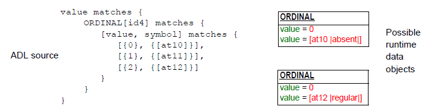
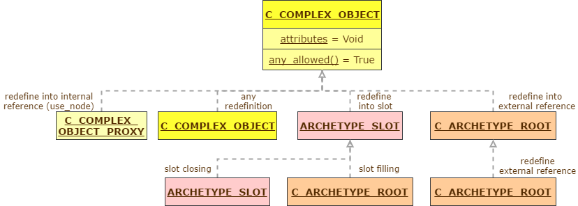

= Constraint Model Package

== Overview

Figure [[constraint_model_top]] and Figure [[constraint_model_bottom]] illustrate the object model of constraints used in an archetype definition. This model is completely generic, and is designed to express the semantics of constraints on instances of classes which are themselves described in any orthodox object-oriented formalism, such as UML. Accordingly, the major abstractions in this model correspond to major abstractions in object-oriented formalisms, including several variations of the notion of 'object' and the notion of 'attribute'. The notion of 'object' rather than 'class' or 'type' is used because archetypes are about constraints on data (i.e. 'instances', or 'objects') rather than models, which are constructed from 'classes'. In this document, the word 'attribute' refers to any data property of a class, regardless of whether regarded as a 'relationship' (i.e. association, aggregation, or composition) or 'primitive' (i.e. value) attribute in an object model.

[.text-center]
.constraint_model Package
image::{uml_export_dir}/diagrams/AOM-constraint_model-top.svg[id=constraint_model_top, align="center"]

The definition part of an archetype is an instance of a `C_COMPLEX_OBJECT` and consists of alternate layers of object and attribute constrainer nodes, each containing the next level of nodes. At the leaves are primitive object constrainer nodes constraining primitive types such as `String` , `Integer` etc. There are also nodes that represent internal references to other nodes, constraint reference nodes that refer to a text constraint in the constraint binding part of the archetype terminology, and archetype constraint nodes, which represent constraints on other archetypes allowed to appear at a given point. The full list of concrete node types is as follows:

* `C_COMPLEX_OBJECT` : any interior node representing a constraint on instances of some non-primitive type, e.g. `OBSERVATION` , `SECTION` ;
* `C_ATTRIBUTE` : a node representing a constraint on an attribute (i.e. UML 'relationship' or 'primitive attribute') in an object type;
* `C_PRIMITIVE_OBJECT` : an node representing a constraint on a primitive (built-in) object type;
* `C_COMPLEX_OBJECT_PROXY` : a node that refers to a previously defined `C_COMPLEX_OBJECT` node in the same archetype. The reference is made using a path;
* `ARCHETYPE_SLOT` : a node whose statements define a constraint that determines which other archetypes can appear at that point in the current archetype. It can be thought of like a keyhole, into which few or many keys might fit, depending on how specific its shape is. Logically it has the same semantics as a `C_COMPLEX_OBJECT` , except that the constraints are expressed in another archetype, not the current one.
* `C_ARCHETYPE_ROOT` : stands for the root node of an archetype; enables another archetype to be referenced from the present one. Used in both archetypes and templates.

The constraints define which configurations of reference model class instances are considered to conform to the archetype. For example, certain configurations of the classes `PARTY` , `ADDRESS` , `CLUSTER` and `ELEMENT` might be defined by a Person archetype as allowable structures for 'people with identity, contacts, and addresses'. Because the constraints allow optionality, cardinality and other choices, a given archetype usually corresponds to a set of similar configurations of objects.

[.text-center]
.constraint_model.primitive Package
image::{uml_export_dir}/diagrams/AOM-constraint_model-bottom.svg[id=constraint_model_bottom, align="center"]

The type-name nomenclature `C_XXX` used here is intended to be read as "constraint on objects of type `XXXX` ", i.e. a `C_COMPLEX_OBJECT` is a "constraint on a complex object (defined by a complex reference model type)". These type names are used below in the formal model.

== Semantics

The effect of the model is to create archetype description structures that are a hierarchical alternation of object and attribute constraints. This structure can be seen by inspecting an ADL archetype, or by viewing an archetype in the <<openEHR_ADL_workbench>>, and is a direct consequence of the object-oriented principle that classes consist of properties, which in turn have types that are classes. (To be completely correct, types do not always correspond to classes in an object model, but it does not make any difference here). The repeated object/attribute hierarchical structure of an archetype provides the basis for using paths to reference any node in an archetype. Archetype paths follow a syntax that is a directly convertible in and out of the W3C Xpath syntax.

=== All Node Types

==== Path Functions

A small number of properties are defined for all node types. The path feature computes the path to the current node from the root of the archetype, while the has_path function indicates whether a given path can be found in an archetype.

==== Conformance Functions

All node types include two functions that formalise the notion of conformance of a specialised archetype to a parent archetype. Both functions take an argument which must be a corresponding node in a parent archetype, not necessarily the immediate parent. A 'corresponding' node is one found at the same or a congruent path. A congruent path is one in which one or more at-codes have been redefined in the specialised archetype.

The `_c_conforms_to_` function returns True if the node on which it is called is a valid specialisation of the 'other' node. The `_c_congruent_to_` function returns True if the node on which it is called is the same as the other node, with the possible exception of a redefined at-code. The latter may happen due to the need to restrict the domain meaning of node to a meaning narrower than that of the same node in the parent. The formal semantics of both functions are given in the section link:AOM2.htm#50487317_85899[See Class Definitions].

==== Any_allowed

The `_any_allowed_` function defined on some node types indicates that any value permitted by the reference model for the attribute or type in question is allowed by the archetype; its use permits the logical idea of a completely "open" constraint to be simply expressed, avoiding the need for any further substructure.

=== Attribute Nodes

Constraints on reference model attributes, including computed attributes (represented by functions with no aguments in most programming languages), are represented by instances of `C_ATTRIBUTE` . The expressible constraints include:

* `_is_multiple_`: a flag that indicates whether the `C_ATTRIBUTE` is constraining a multiply-valued (i.e. container) RM attribute or a single-valued one;
* `_existence_`: whether the corresponding instance (defined by the `_rm_attribute_name_` attribute) must exist;
* child objects: representing allowable values of the object value(s) of the attribute.

In the case of single-valued attributes (such as Person.date_of_birth) the children represent one or more alternative object constraints for the attribute value.

For multiply-valued attributes (such as `Person`.`_contacts_`: `List<Contact>`), a cardinality constraint on the container can be defined. The constraint on child objects is essentially the same except that more than one of the alternatives can co-exist in the data. Figure <<c_attributes>> illustrates the two possibilities.

The appearance of both `_existence_` and `_cardinality_` constraints in `C_ATTRIBUTE` deserves some explanation, especially as the meanings of these notions are often confused in object-oriented literature. An existence constraint indicates whether an object will be found in a given attribute field, while a cardinality constraint indicates what the valid membership of a container object is. `_Cardinality_` is only required for container objects such as `List<T>` , `Set<T>` and so on, whereas `_existence_` is always possible. If both are used, the meaning is as follows: the existence constraint says whether the container object will be there (at all), while the cardinality constraint says how many items must be in the container, and whether it acts logically as a list, set or bag. Both existence and cardinality are optional in the model, since they are only needed to override the settings from the reference model.

[.text-center]
.C_ATTRIBUTE variants
image::diagrams/c_attributes.png[id=c_attributes, align="center", width="70%"]

=== Object Node Types

==== Node_id and Paths

The `_node_id_` attribute in the class `C_OBJECT`, inherited by all subtypes, is of key importance in the archetype constraint model. It has two functions:

* it allows archetype object constraint nodes to be individually identified, and in particular, guarantees sibling node unique identification;
* it provides a code to which a human-understanding terminology definition can be attached, as well as potentially a terminology binding.

The existence of `_node_ids_` in an archetype allows archetype paths to be created, which refer to each node. Every node in the archetype needs a `_node_id_` , but only node_ids for nodes under container attributes must have a terminology definition. For nodes under single-valued attributes, the terminology definition is optional (and typically not supplied), since the meaning is given by the reference model attribute definition.

==== Sibling Ordering

Within a specialised archetype, redefined or added object nodes may be defined under a container attribute. Since specialised archetypes are in differential form, i.e. only redefined or added nodes are expressed, not nodes inherited unchanged, the relative ordering of siblings can't be stated simply by the ordering of such items within the relevant list within the differential form of the archetype. An explicit ordering indicator is required if indeed order is specific. The `C_OBJECT`.`_sibling_order_` attribute provides this possibility. It can only be set on a `C_OBJECT` descendant within a multiply-valued attribute, i.e. an instance of `C_ATTRIBUTE` for which the `_cardinality_` is ordered.

==== Node Deprecation

It is possible to mark an instance of any defined node type as deprecated, meaning that by preference it should not be used, and that there is an alternative solution for recording the same information. Rules or recommendations for how deprecation should be handled are outside the scope of the archetype proper, and should be provided by the governance framework under which the archetype is managed.

=== Defined Object Nodes (C_DEFINED_OBJECT)

The `C_DEFINED_OBJECT` subtype corresponds to the category of `C_OBJECTs` that are defined in an archetype by value, i.e. by inline definition. Four properties characterise `C_DEFINED_OBJECT` s as follows.

==== Valid_value

The `_valid_value_` function tests a reference model object for conformance to the archetype. It is designed for recursive implementation in which a call to the function at the top of the archetype definition would cause a cascade of calls down the tree. This function is the key function of an 'archetype-enabled kernel' component that can perform runtime data validation based on an archetype definition.

==== Prototype_value

This function is used to generate a reasonable default value of the reference object being constrained by a given node. This allows archteype-based software to build a 'prototype' object from an archetype which can serve as the initial version of the object being constrained, assuming it is being created new by user activity (e.g. via a GUI application). Implementation of this function will usually involve use of reflection libraries or similar.

==== Default_value

This attribute allows a user-specified default value to be defined within an archetype. The `_default_value_` object must be of the same type as defined by the `_prototype_value_` function, pass the `_valid_value_` test. Where defined, the `_prototype_value_` function would return this value instead of a synthesised value.

==== 'Frozen' Nodes

A node may be redefined into multiple child nodes in a specialised archetype. If the children are considered to exhaustively define the value space corresponding to the original node, the latter may be 'frozen', meaning no further children can be defined. This also has a runtime implication: a frozen node cannot have any instances, only its children can.

=== Reference Objects

The types `ARCHETYPE_SLOT` and `C_COMPLEX_OBJECT_PROXY` are used to express, respectively, a 'slot' where further archetypes can be used to continue describing constraints; a reference to a part of the current archetype that expresses exactly the same constraints needed at another point.

=== Complex Objects (C_COMPLEX_OBJECT)

Along with `C_ATTRIBUTE`, `C_COMPLEX_OBJECT` is the key structuring type of the `constraint_model` package, and consists of attributes of type `C_ATTRIBUTE` , which are constraints on the attributes (i.e. any property, including relationships) of the reference model type. Accordingly, each `C_ATTRIBUTE` records the name of the constrained attribute (in `_rm_attr_name_`) , the existence and cardinality expressed by the constraint (depending on whether the attribute it constrains is a multiple or single relationship), and the constraint on the object to which this `C_ATTRIBUTE` refers via its `_children_` attribute (according to its reference model) in the form of further `C_OBJECTs` .

=== Primitive Types (C_PRIMITIVE_OBJECT descendants)

Constraints on primitive types are defined by the classes inheriting from `C_PRIMITIVE_OBJECT` , i.e. `C_STRING` , `C_INTEGER` and so on. The primitive types are represented in such a way as to accommodate both 'tuple' constraints and logically unary constraints, using a tuple array whose members are each a primitive constraint corresponding to each primitive type. Tuple constraints are second order constraints, described below, enable covarying constraints to be stated. In the unary case, the constraint is the first member of a tuple array.

The primitive constraint for each primitive type may itself be complex. Its type is given by the type of the constraint accessor in each `C_PRIMITIVE_OBJECT` descendant and is summarised in the following table.

[width="100%",cols="1,2,3",options="header",]
|===========
|Primitive type     |Primitive constrainer type |Explanation
|Boolean            |`List <Boolean>`           |Can represent one or two Boolean values, enabling the logical constraints 'true', 'false' and 'true or false' to be expressed.
|String             |`List <String>`            |A list of possible string values, which may include regular expressions, which are delimited by '/' characters.
|Terminology_code   |`String` - `[acN]` or `[atN]`` |A string containing either a single at-code or a single ac-code. In the latter case, the constraint refers to either a locally defined value set or (via a binding) an external value set.
|*Ordered types*    |`List <Interval<T>>`       |Can represent a single value (which is a point interval), a list of values (list of point intervals), a list of intervals, which may be mixed proper and point intervals.
|Integer            |`List <Interval<Integer>>` |As for Ordered type, with T = `Integer`
|Real               |`List <Interval<Real>>`    |As for Ordered type, with T = `Real`
|*Temporal types*   |`List <Interval<T->ISO8601_TYPE>>` +
                     OR +
                    `String` (ADL pattern)      |As for ordered types, with T being an ISO8601-based type, with the addition of a second type constraint - a pattern based on ISO8601 syntax. See <<openehr_am_adl>>.
|Date               |`List <Interval<ISO8601_DATE>>` +
                     OR +
                     pattern                    |As for Temporal types with T = `ISO8601_DATE`
|Time               |`List <Interval<ISO8601_TIME>>` +
                     OR +
                     pattern                    |As for Temporal types with T = `ISO8601_TIME`
|Date_time          |`List <Interval<ISO8601_DATE_TIME>>` +
                     OR +
                     pattern                    |As for Temporal types with T = `ISO8601_DATE_TIME`
|Duration           |`List <Interval<ISO8601_DURATION>>` +
                     OR +
                     pattern                    |As for Temporal types with T = `ISO8601_DURATION`
|===========

==== Assumed_value

The `_assumed_value_` attribute is useful for archetypes containing any optional constraint. and provides an ability to define a value that can be assumed for a data item for which no data is found at execution time. If populated, it can contain a single at-code that must be in the local value set referred to by the ac-code in the `_constraint_` attribute.

For example, an archetype for the concept 'blood pressure measurement' might contain an optional protocol section containing a data point for patient position, with choices 'lying', 'sitting' and 'standing'. Since the section is optional, data could be created according to the archetype which does not contain the protocol section. However, a blood pressure cannot be taken without the patient in some position, so clearly there is an implied value for patient position. Amongst clinicians, basic assumptions are nearly always made for such things: in general practice, the position could always safely be assumed to be "sitting" if not otherwise stated; in the hospital setting, "lying" would be the normal assumption. The assumed_value feature of archetypes allows such assumptions to be explicitly stated so that all users/systems know what value to assume when optional items are not included in the data.

Note that the notion of assumed values is distinct from that of 'default values'. The latter notion is that of a default 'pre-filled' value that is provided (normally in a local context by a template) for a data item that is to be filled in by the user, but which is typically the same in many cases. Default values are thus simply an efficiency mechanism for users. As a result, default values do appear in data, while assumed values don't.

=== Terminology Constraints (C_TERMINOLOGY_CODE)

The `C_TERMINOLOGY_CODE` type entails some complexity and merits further explanation. This is the only constrainer type whose constraint semantics are not self-contained, but located in the archetype terminology and/or in external terminologies.

A `C_TERMINOLOGY_CODE` instance in an archetype is simple: it can only be one of the following constraints:

* a single ac-code, referring to either a value-set defined in the archetype terminology or bound to an external value set or ref set;
** in this case, an additional at-code may be included as an assumed value; the at-code must come from the locally defined value set;
* a single at-code, repesenting a single possible value. 

NOTE: The second case in theory could be done using an ac-code referring to a value set containing a single value, but there seems little value in this extra verbiage, and little cost in providing the single-member value set short cut.

In addition, a `C_TERMINOLOGY_CODE` instance can reconstitute the internal value set via access to the archetype terminology (this has to be set up within the implementation). If bindings are evaluated, the external form of a value set can potentially be obtained as well. The utility of this is to be able to evaluate and cache certain external 'ref sets' when evaluating the Operational Template.

==== Terminology Code Resolution

When an archetype is deployed in the form of an operational template, the internally defined value sets, and any bindings are processed in stages in order to obtain the final terminology codes from which the user should choose. The `C_TERMINOLOGY_CODE` class provides a number of functions to formalise this as follows.

* `_value_set_expanded_: List<String>`: this function converts an ac-code to its corresponding set of at-codes, as defined in the `value_sets` section of the archetype.
* `_value_set_substituted_: List<URI>`: where bindings exist to he value set at-codes, this function converts each code to its corresponding binding target, i.e. a URI.
* `_value_set_resolved_: List<TERMINOLOGY_CODE>`: this function converts the list of URIs to final terms, including with textual rubrics, i.e. a list of `TERMINOLOGY_CODEs`.

These functions would normally be implemented as 'lambdas' or 'agents', in order to obtain access to the target terminologies.

NOTE: Since an archetype might not contain external terminology bindings for all (or even any) of its terminological constraints, a 'resolved' archetype will usually contain at-codes in its cADL definition. These at-codes would be treated as real coded terms in any implementation that was creating data, and as a consequence, archetype at-codes could occur in real data, as described in the the Terminology Integration section of the ADL specification. 

=== Constraints on Enumeration Types

Enumeration types in the reference model are assumed to have semantics expected in UML, and mainstream programming languages, i.e. to be a distinct type based on a primitive type, normally Integer or String. Each such type consists of a set of values from the domain of its underlying type, thus, a set of Integer, String or other primitive values. Each of these values is assumed to be named in the manner of a symbolic constant. Although stricly speaking UML doesn't require an enumerated type to be based on an underlying primitive type, programming languages do, hence the assumption here that values from the domain of such a type are involved.

A constraint on an enumerated type therefore consists of an AOM instance of a `C_PRIMITIVE` descendant, almost always `C_INTEGER` or `C_STRING` . The flag `_is_enumerated_type_constraint_` defined on `C_PRIMITIVE` indicates that a given `C_PRIMITIVE` is a constrainer for an enumerated type.

Since `C_PRIMITIVEs` don't have type names in ADL, the type name is inferred by any parser or compiler tool that deserialises an archetype from ADL, and stored in the `_rm_type_` attribute inherited from `C_OBJECT` . An example is shown below of a type enumeration.

[.text-center]
.Enumerated Constraint
image::diagrams/enumerated_type_constraint.png[id=enumerated_constraint, align="center", width="70%"]

A parser that deserialises from an object dump format such as ODIN, JSON or XML will not need to do this.

The form of the constraint itself is simply a series of Integer, String or other primitive values, or an equivalent range or ranges. In the above example, the ADL equivalent of the pk_percent, pk_fraction constraint on a field of type `PROPORTION_KIND` is in fact just __\{2, 3}__, and it is visualised by lookup to show the relevant symbolic names.

== Second Order Constraints

All of the constraint semantics described above can be considered 'first order' in the sense that they define how specific object/attribute/object hierarchies are defined in the instance possibility space of some part of a reference model.

Some constraints however do not fit directly within the object/attribute/object hierarchy scheme, and are considered 'second order constraints' in the archetype formalism. The 'rule' constraints ('invariants' in ADL/AOM 1.4) constitute one such group. These constraints are defined in terms of first order predicate logic statements that can refer to any number of constraint nodes within the main hierarchy. These are described in Figure <<rules_package>>.

Another type of second order constraint can be 'attached' to the object/attribute/object hierarchy in order to further limit structural possibilities. Although these constraints could also theoretically be expressed as rules, they are supported by direct additions to the main constraint model since they can be easily and intuitively represented 'inline' in ADL and corresponding AOM structures.

=== Tuple Constraints

Tuple constraints are designed to account for the very common need to constrain the values of more than one RM class attribute together. This effectively treats the attributes in question as a tuple, and the corresponding object constraints are accordingly modelled as tuples. Additions to the main constraint model to support tuples are shown below.

[.text-center]
.Tuple Constraint Model
image::{uml_export_dir}/diagrams/AOM-constraint_model-tuple.svg[id=tuple_constraint_model, align="center"]

In this model, the type `C_ATTRIBUTE_TUPLE` groups the co-constrained `C_ATTRIBUTE`s under a `C_COMPLEX_OBJECT`. Currently the concrete type is limited to being `C_PRIMITIVE_OBJECT`, to reduce complexity, and since this caters for the known examples of tuple constraints. In principle, any `C_DEFINED_OBJECT` would be allowed, and this may change in the future.

The tuple constraint type replaces all domain-specific constraint types defined in ADL/AOM 1.4, including `C_DV_QUANTITY` and `C_DV_ORDINAL`.

These additions allow standard constraint structures (i.e. `C_ATTRIBUTE` / `C_COMPLEX_OBJECT` / `C_PRIMITIVE_OBJECT` hierarchies) to be 'annotated', while leaving the first order structure intact. The following example shows an archetype instance structure in which a notional `ORDINAL` type is constrained. The logical requirement is to constrain a `ORDINAL` to one of three instance possibilities, each of which consists of a pair of values for the attributes value and symbol, of type Integer and `TERMINOLOGY_CODE` respectively. Each of these three instance constraints should be understood as an alternative for the single valued owning attribute, `ELEMENT` .value. Tuple constraints achieve the requirement to express the constraints as pairs not just as allowable alternatives at the final leaf level, which would incorrectly allowing any mixing of the Integer and code values.

[.text-center]
.Tuple Constraint Example AOM Instances
image::{uml_export_dir}/diagrams/AOM-ordinal_tuple_example.svg[id=ordinal_tuple_example, align="center"]

[.text-center]
.Tuple Constraint Example Data

=== Assertions

Assertions are also used in `ARCHETYPE_SLOTs` , in order to express the 'included' and 'excluded' archetypes for the slot. In this case, each assertion is an expression that refers to parts of other archetypes, such as its identifier (e.g. 'include archetypes with `_short_concept_name_` matching `xxxx` '). Assertions are modelled here as a generic expression tree of unary prefix and binary infix operators. Examples of archetype slots in ADL syntax are given in the openEHR ADL specifcation <<openehr_am_adl>>.

== AOM Type Substitutions

The `C_OBJECT` types defined in Figure <<constraint_model_top>> are reproduced below, with concrete types that may actually occur in archetypes shown in dark yellow / non-italic.

[.text-center]
.C_Object Substitutions

Within a specialised archetype, nodes that redefine corresponding nodes in the parent are normally of the same `C_OBJECT` type (we can think of this as a 'meta-type', since the RM type is the 'type' in the information model sense), but in some cases may also be of different `C_OBJECT` types.

The rules for meta-type redefinition are as follows:

* A node of each meta-type can be redefined by a node of the same meta-type, with narrowed / added constraints;
* `ARCHETYPE_SLOT` can be redefined by:
** one or more `C_ARCHETYPE_ROOT` nodes taken together, considered to define a 'filled' version of the slot;
** an `ARCHETYPE_SLOT` , in order to close the slot.
* A `C_ARCHETYPE_ROOT` node can be redefined by:
** A `C_ARCHETYPE_ROOT` , where the archetype_ref of the redefining node is a specialisation of that mentioned in the parent node.
* A terminal `C_COMPLEX_OBJECT` node containing no constraint other than RM type, `_node_id_` and possibly occurrences (i.e. having no substructure), can be redefined by a constraint of any other AOM type.

The 'terminal `C_COMPLEX_OBJECT` ' can be understood as a placeholder node primarily defined for the purpose of stating meaning.

== Class Definitions

include::{uml_export_dir}/classes/archetype_constraint.adoc[]

include::{uml_export_dir}/classes/c_attribute.adoc[]

=== Conformance Semantics

The following functions formally define the conformance of an attribute node in a specialised archetype to the corresponding node in a parent archetype, where 'corresponding' means a node found at the same or a congruent path.

[source,eiffel]
---------
c_conforms_to (other: like Current): Boolean
    require
        other /= Void
    do
        Result := existence_conforms_to (other) and 
            ((is_single and other.is_single) or else
            (is_multiple and cardinality_conforms_to (other)))
    end

c_congruent_to (other: like Current): Boolean
    require
        other /= Void
    do
        Result := existence = Void and ((is_single and other.is_single) or
                (is_multiple and other.is_multiple and cardinality = Void))
    end

existence_conforms_to (other: like Current): Boolean
    require
        other_exists: other /= Void
    do
        if existence /= Void and other.existence /= Void then
            Result := other.existence.contains (existence)
        else
            Result := True
        end
    end

cardinality_conforms_to (other: like Current): Boolean
    require
        other_exists: other /= Void
    do
        if cardinality /= Void and other.cardinality /= Void then
            Result := other.cardinality.contains (cardinality)
        else
            Result := True
        end
    end
---------

== Validity Rules

The validity rules are as follows:

[.rule]
*VCARM*: attribute name reference model validity: an attribute name introducing an attribute constraint block must be defined in the underlying information model as an attribute (stored or computed) of the type which introduces the enclosing object block.

[.rule]
*VCAEX*: archetype attribute reference model existence conformance: the existence of an attribute, if set, must conform, i.e. be the same or narrower, to the existence of the corresponding attribute in the underlying information model.

[.rule]
*VCAM*: archetype attribute reference model multiplicity conformance: the multiplicity, i.e. whether an attribute is multiply- or single-valued, of an attribute must conform to that of the corresponding attribute in the underlying information model.

[.rule]
*VDIFV*: archetype attribute differential path validity: an archetype may only have a differential path if it is specialised..

The following validity rule applies to redefinition in a specialised archetype:

[.rule]
*VDIFP*: specialised archetype attribute differential path validity: if an attribute constraint has a differential path, the path must exist in the flat parent, and also be valid with respect to the reference model, i.e. in the sense that it corresponds to a legal potential construction of objects.

[.rule]
*VSANCE*: specialised archetype attribute node existence conformance: the existence of a redefined attribute node in a specialised archetype, if stated, must conform to the existence of the corresponding node in the flat parent archetype, by having an identical range, or a range wholly contained by the latter.

[.rule]
*VSAM*: specialised archetype attribute multiplicity conformance: the multiplicity, i.e. whether an attribute is multiply- or single-valued, of a redefined attribute must conform to that of the corresponding attribute in the parent archetype.

The following validity rules apply to single-valued attributes, i.e when `C_ATTRIBUTE`.`_is_multiple_` is False:

[.rule]
*VACSO*: single-valued attribute child object occurrences validity: the occurrences of a child object of a single-valued attribute cannot have an upper limit greater than 1.

The following validity rules apply to container attributes, i.e when `C_ATTRIBUTE`.`_is_multiple_` is True:

[.rule]
*VACMCU*: cardinality/occurrences upper bound validity: where a cardinality with a finite upper bound is stated on an attribute, for all immediate child objects for which an occurrences constraint is stated, the occurrences must either have an open upper bound (i.e. n..*) which is interpreted as the maximum value allowed within the cardinality, or else a finite upper bound which is <= the cardinality upper bound.

[.rule]
*VACMCO*: cardinality/occurrences orphans: it must be possible for at least one instance of one optional child object (i.e. an object for which the occurrences lower bound is 0) and one instance of every mandatory child object (i.e. object constraints for which the occurrences lower bound is >= 1) to be included within the cardinality range.

[.rule]
*VCACA*: archetype attribute reference model cardinality conformance: the cardinality of an attribute must conform, i.e. be the same or narrower, to the cardinality of the corresponding attribute in the underlying information model.

The following validity warnings apply to container attributes, i.e when `C_ATTRIBUTE`.`_is_multiple_` is True:

[.rule]
*WACMCL*: cardinality/occurrences lower bound validity: where a cardinality with a finite upper bound is stated on an attribute, for all immediate child objects for which an occurrences constraint is stated, the sum of occurrences lower bounds should be lower than the cardinality upper limit.

The following validity rule applies to cardinality redefinition in a specialised archetype:

[.rule]
*VSANCC*: specialised archetype attribute node cardinality conformance: the cardinality of a redefined (multiply-valued) attribute node in a specialised archetype, if stated, must conform to the cardinality of the corresponding node in the flat parent archetype by either being identical, or being wholly contained by the latter.

include::{uml_export_dir}/classes/cardinality.adoc[]

include::{uml_export_dir}/classes/c_object.adoc[]

== Occurrences inferencing rules

The notion of 'occurrences' does not exist in an object model that might be used as the reference model on which archteypes are based, because it is a class model. However, archetypes make statements about how many objects conforming to a specific object constraint node might exist, within a container attribute. In an operational template, an occurrences constraint is required on all children of container attributes. Most such constraints come from the source template(s) and archetypes, but in some cases, there will be nodes with no occurrences. In these cases, the occurrences constraint is inferred from the reference model according to the following algorithm, where `c_object` represents any object node in an archetype.

[source,eiffel]
---------
if not c_object.is_root and c_object.occurrences = Void then
    if is_container_attribute_in_rm (c_object.parent) then
        if rm_parent_attr.cardinality.upper_unbounded then
            c_object.set_occurrences (|0..*|)
        else
            c_object.set_occurrences (|0..rm_parent_attr.cardinality.upper|)
        end
    else
        c_object.set_occurrences (rm_parent_attr.existence)
    end
end
---------

Occurrences is not really required on children of single-valued attributes, because the notional occurrences is always the same as the existence constraint of the owning attribute in the flat parent structure, or else the reference model.

== Conformance semantics

The following functions formally define the conformance of an object node in a specialised archetype to the corresponding node in a parent archetype, where 'corresponding' means a node found at the same or a congruent path.

[source,eiffel]
---------
c_conforms_to (other: like Current): Boolean
    require
        other /= Void
    do
        Result := node_id_conforms_to (other) and
            occurrences_conforms_to (other) and
            (rm_type_name.is_equal (other.rm_type_name) or else
            rm_types_conformant(rm_type_name, other.rm_type_name))
    end

c_congruent_to (other: like Current): Boolean
        -- True if this node makes no changes to 'other' (from a
        -- specialisation parent archetype) apart from possible
        -- change of node-id
    require
        other /= Void
    do
        Result := rm_type_name.is_case_insensitive_equal (other.rm_type_name) and
            (occurrences = Void or else occurrences ~ other.occurrences) and
            (sibling_order = Void or else sibling_order ~ other.sibling_order) and
            node_reuse_congruent (other)
    end

rm_type_conforms_to (other: like Current): Boolean
    require
        other /= Void
    do
        Result := rm_type_name.is_equal (other.rm_type_name) or
            rm_checker.is_sub_type_of (rm_type_name, other.rm_type_name)
    end

occurrences_conforms_to (other: like Current): Boolean
    require
        other_exists: other /= Void
        other_is_flat: other.occurrences /= Void
    do
        if occurrences /= Void and other.occurrences /= Void then
            Result := other.occurrences.contains (occurrences)
        else
            Result := True
        end
    end

node_id_conforms_to (other: like Current): Boolean
    require
        other_exists: other /= Void
    do
        Result := codes_conformant (node_id, other.node_id)
    end
---------

== Validity Rules

The validity rules for all `C_OBJECTs` are as follows:

[.rule]
*VCORM* object constraint type name existence: a type name introducing an object constraint block must be defined in the underlying information model.

[.rule]
*VCORMT* object constraint type validity: a type name introducing an object constraint block must be the same as or conform to the type stated in the underlying information model of its owning attribute.

[.rule]
*VCOCD* object constraint definition validity: an object constraint block consists of one of the following (depending on subtype): an 'any' constraint; a reference; an inline definition of sub-constraints, or nothing, in the case where occurrences is set to \{0}.

[.rule]
*VCOID* object node identifier validity: every object node must have a node identifier.

[.rule]
*VCOSU* object node identifier validity: every object node must be unique within the archetype.

The following validity rules govern `C_OBJECTs` in specialised archetypes.

[.rule]
*VSONT* specialised archetype object node meta-type conformance: the meta-type of a redefined object node (i.e. the AOM node type such as `C_COMPLEX_OBJECT` etc) in a specialised archetype must be the same as that of the corresponding node in the flat parent, with the following exceptions: a `C_COMPLEX_OBJECT` with no child attributes may be redefined by a node of any AOM type; a `C_COMPLEX_OBJECT_PROXY`, may be redefined by a `C_COMPLEX_OBJECT`; a `ARCHTEYPE_SLOT` may be redefined by `C_ARCHETYPE_ROOT` (i.e. 'slot-filling'). See also validity rules VDSSID and VARXID.

[.rule]
*VSONCT* specialised archetype object node reference type conformance: the reference model type of a redefined object node in a specialised archetype must conform to the reference model type in the corresponding node in the flat parent archetype by either being identical, or conforming via an inheritance relationship in the relevant reference model.

[.deprecated]
_Deprecated_: *VSONIR* specialised archetype redefined object node identifier condition: the node identifier of an object node in a specialised archetype that is a redefinition of a node in the flat parent must be redefined if any of reference model type, node identifier definition in the terminology, or occurrences of the immediate object constraint is redefined, with the exception of occurrences being redefined to \{0}, i.e. exclusion.

[.deprecated]
_Deprecated_: *VSONI* specialised archetype redefined object node identifier validity: if an object node in a specialised archetype is a redefinition of a node in the flat parent according to VSONIR, and the parent node carries a node identifier, it must carry a node identifier specalised at the level of the child archetype. Otherwise it must carry the same node identifier (or none) as the corresponding parent node.

[.rule]
*VSONIN* specialised archetype new object node identifier validity: if an object node in a specialised archetype is a new node with respect to the flat parent, and it carries a node identifier, the identifier must be a 'new' node identifier, specalised at the level of the child archetype.

[.rule]
*VSONIF* specialised archetype object node identifier validity in flat siblings: the identification (or not) of an object node in a specialised archetype must be valid with respect to any sibling object nodes in the flattened parent (see VACMI).

[.rule]
*VSONCO* specialised archetype redefine object node occurrences validity: the occurrences of a redefined object node in a specialised archetype, if stated, must conform to the occurrences in the corresponding node in the flat parent archetype by either being identical, or being wholly contained by the latter.

[.rule]
*VSONPT* specialised archetype prohibited object node AOM type validity: the occurrences of a redefined object node in a specialised archetype, may only be prohibited (i.e. \{0}) if the matching node in the parent is of the same AOM type.

[.rule]
*VSONPI* specialised archetype prohibited object node AOM node id validity: a redefined object node in a specialised archetype with occurrences matching \{0} must have exactly the same node id as the node in the flat parent being redefined.

[.rule]
*VSONPO* specialised archetype object node prohibited occurrences validity: the occurrences of a new (i.e. having no corresponding node in the parent flat) object node in a specialised archetype, if stated, may not be 'prohibited', i.e. \{0}, since prohibition only makes sense for an existing node.

[.rule]
*VSSM* specialised archetype sibling order validity: the sibling order node id code used in a sibling marker in a specialised archetype must refer to a node found within the same container in the flat parent archetype.

include::{uml_export_dir}/classes/sibling_order.adoc[]
include::{uml_export_dir}/classes/c_defined_object.adoc[]
include::{uml_export_dir}/classes/c_complex_object.adoc[]

== Validity Rules

The validity rules for `C_COMPLEX_OBJECTs` are as follows:

[.rule]
*VCATU* attribute uniqueness: sibling attributes occurring within an object node must be uniquely named with respect to each other, in the same way as for class definitions in an object reference model.

include::{uml_export_dir}/classes/c_archetype_root.adoc[]

==== Validity Rules

The following validity rules apply to `C_ARCHETYPE_ROOT` objects:

[.rule]
*VARXS* external reference conforms to slot: the archetype reference must conform to the archetype slot constraint of the flat parent and be of a reference model type from the same reference model as the current archetype.

[.rule]
*VARXNC* external reference node identifier validity: if the reference object is a redefinition of either a slot node, or another external reference node, the node_id of the object must conform to (i.e. be the same or a child of) the node_id of the corresponding parent node.

[.rule]
*VARXAV* external reference node archetype reference validity: if the reference object is a redefinition of another external reference node, the archetype_ref of the object must match a real archetype that has as an ancestor the archetype matched by the archetype reference mentioned in the corresponding parent node.

[.rule]
*VARXTV* external reference type validity: the reference model type of the reference object archetype identifier must be identical, or conform to the type of the slot, if there is one, in the parent archetype, or else to the reference model type of the attribute in the flat parent under which the reference object appears in the child archetype.

[.rule]
*VARXR* external reference refers to resolvable artefact: the archetype reference must refer to an artefact that can be found in the current repository.

The following validity rules apply to a `C_ARCHETYPE_ROOT` that specialises a `ARCHETYPE_SLOT` in the parent archetype:

[.rule]
*VARXID* external reference slot filling id validity: an external reference node defined as a filler for a slot in the parent archetype must have a node id that is a specialisation of that of the slot.

include::{uml_export_dir}/classes/archetype_slot.adoc[]

==== Validity Rules

The validity rules for `ARCHETYPE_SLOTs` are as follows:

[.rule]
*VDFAI* archetype identifier validity in definition. Any archetype identifier mentioned in an archetype slot in the definition section must conform to the published openEHR specification for archetype identifiers.

[.rule]
*VDSIV* archetype slot 'include' constraint validity. The 'include' constraint in an archetype slot must conform to the slot constraint validity rules.

[.rule]
*VDSEV* archetype slot 'exclude' constraint validity. The 'exclude' constraint in an archetype slot must conform to the slot constraint validity rules.

The slot constraint validity rules are as follows:

[source,eiffel]
---------
if includes not empty and = any then
    not (excludes empty or /= any) ==> VDSEV Error
elseif includes not empty and /= any then
    not (excludes empty or = any) ==> VDSEV Error
elseif excludes not empty and = any then
    not (includes empty or /= any) ==> VDSIV Error
elseif excludes not empty and /= any then
    not (includes empty or = any) ==> VDSIV Error
end
---------

The following validity rules apply to `ARCHETYPE_SLOTs` defined as the specialisation of a slot in the parent archetype:

[.rule]
*VDSSID* slot redefinition child node id: a slot node in a specialised archetype that redefines a slot node in the flat parent must have an identical node id.

[.rule]
*VDSSM* specialised archetype slot definition match validity. The set of archetypes matched from a library of archetypes by a specialised archetype slot definition must be a proper subset of the set matched from the same library by the parent slot definition.

[.rule]
*VDSSP* specialised archetype slot definition parent validity. The flat parent of the specialisation of an archetype slot must be not be closed (is_closed = False).

[.rule]
*VDSSC* specialised archetype slot definition closed validity. In the specialisation of an archetype slot, either the slot can be specified to be closed (is_closed = True) or the slot can be narrowed, but not both.

include::{uml_export_dir}/classes/c_complex_object_proxy.adoc[]

==== Validity Rules

The following validity rules applies to internal references:

[.rule]
*VUNT* use_node reference model type validity: the reference model type mentioned in an `C_COMPLEX_OBJECT_PROXY` node must be the same as or a super-type (according to the reference model) of the reference model type of the node referred to.

[.rule]
*VUNP* use_node path validity: the path mentioned in a use_node statement must refer to an object node defined elsewhere in the same archetype or any of its specialisation parent archetypes, that is not itself an internal reference node, and which carries a node identifier if one is needed at the reference point.

The following validity rule applies to the redefinition of an internal reference in a specialised archetype:

[.rule]
*VSUNT* use_node specialisation parent validity: a `C_COMPLEX_OBJECT_PROXY` node may be redefined in a specialised archetype by another `C_COMPLEX_OBJECT_PROXY` (e.g. in order to redefine occurrences), or by a `C_COMPLEX_OBJECT` structure that legally redefines the target `C_COMPLEX_OBJECT` node referred to by the reference.

include::{uml_export_dir}/classes/c_primitive_object.adoc[]

==== Validity Rules

The validity rules for `C_PRIMITIVE_OBJECTs` are as follows:

[.rule]
*VOBAV* object node assumed value validity: the value of an assumed value must fall within the value space defined by the constraint to which it is attached.

include::{uml_export_dir}/classes/c_boolean.adoc[]
include::{uml_export_dir}/classes/c_string.adoc[]
include::{uml_export_dir}/classes/c_ordered.adoc[]
include::{uml_export_dir}/classes/c_integer.adoc[]
include::{uml_export_dir}/classes/c_real.adoc[]
include::{uml_export_dir}/classes/c_temporal.adoc[]
include::{uml_export_dir}/classes/c_date.adoc[]
include::{uml_export_dir}/classes/c_time.adoc[]
include::{uml_export_dir}/classes/c_date_time.adoc[]
include::{uml_export_dir}/classes/c_duration.adoc[]
include::{uml_export_dir}/classes/c_terminology_code.adoc[]
include::{uml_export_dir}/classes/c_second_order.adoc[]
include::{uml_export_dir}/classes/c_attribute_tuple.adoc[]

