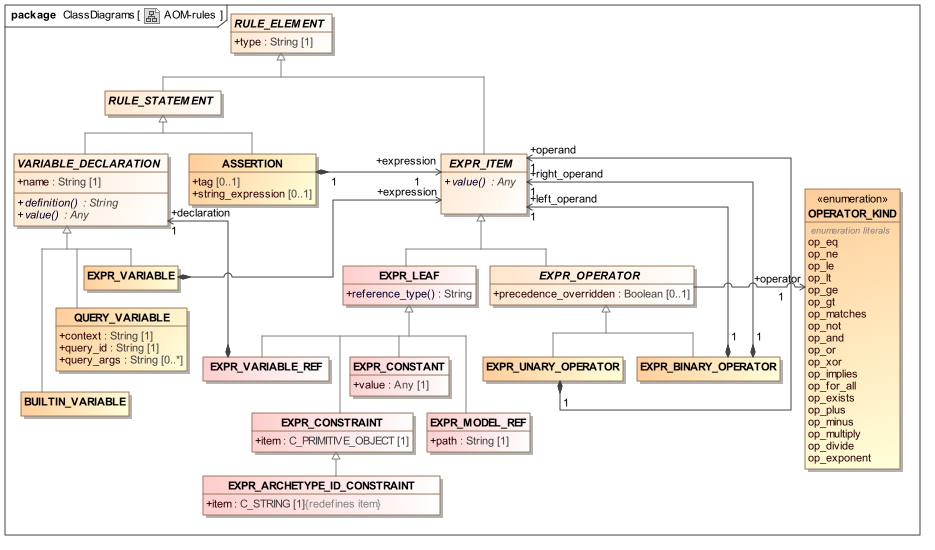

= The Assertion Package

== Overview

Assertions are expressed in archetypes in typed first-order predicate logic (FOL). They are used in two places: to express archetype slot constraints, and to express rules in complex object constraints. In both of these places, their role is to constrain something inside the archetype. Constraints on external resources such as terminologies are expressed in the constraint binding part of the archetype terminology, described in Figure <<terminology_package>>. The assertion package is illustrated below in <<rules_package>>.

[.text-center]
.Rules Package

== Semantics

Archetype assertions are statements which contain the following elements:

* variables, which are inbuilt, archetype path-based, or external query results;
* manifest constants of any primitive type, including the date/time types
* arithmetic operators: +, *, -, /, ^ (exponent), % (modulo division)
* relational operators: >, <, >=, <=, =, !=, matches
* boolean operators: not, and, or, xor
* quantifiers applied to container variables: for_all, exists

A syntax of assertions is defined in the openEHR ADL specification. The package described here is designed to allow the representation of a general-purpose expression tree, as generated by a parser. This relatively simple model of expressions is sufficiently powerful for representing the subset of FOL expressions required in archetypes and templates.

== Class Descriptions

include::./classes/rule_statement.adoc[]
include::./classes/assertion.adoc[]
include::./classes/variable_declaration.adoc[]
include::./classes/expr_variable.adoc[]
include::./classes/builtin_variable.adoc[]
include::./classes/query_variable.adoc[]
include::./classes/expr_item.adoc[]
include::./classes/expr_leaf.adoc[]
include::./classes/expr_constant.adoc[]
include::./classes/expr_constraint.adoc[]
include::./classes/expr_archetype_id_constraint.adoc[]
include::./classes/expr_model_ref.adoc[]
include::./classes/expr_variable_ref.adoc[]
include::./classes/expr_operator.adoc[]
include::./classes/expr_unary_operator.adoc[]
include::./classes/expr_binary_operator.adoc[]
include::./classes/operator_kind.adoc[]

